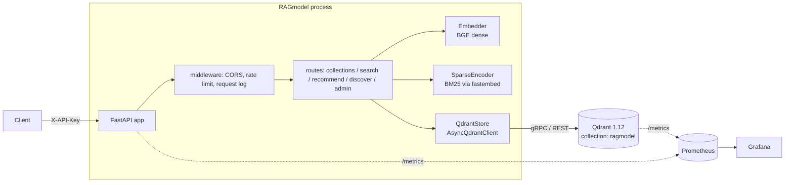
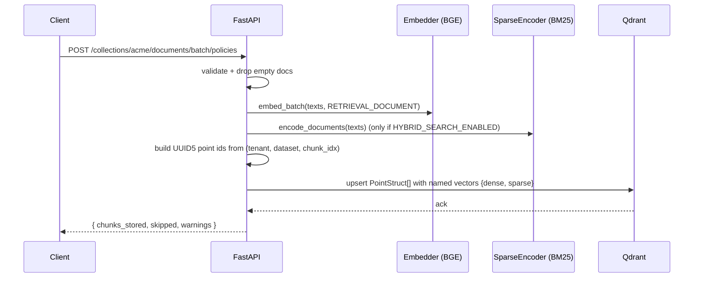
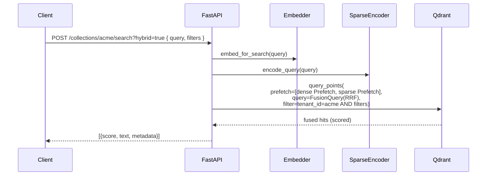

# Architecture

RAGmodel is a single FastAPI process in front of a single Qdrant collection. The collection is multi-tenant: one HNSW graph, one payload storage, tenants isolated by a Qdrant-native `is_tenant=True` keyword index. This document describes the moving pieces and how requests flow through them.

## Component diagram

## Tenancy model

A single physical collection `ragmodel` holds all tenants. Two payload indexes do the isolation work:

| Payload key | Index type | Why |
|---|---|---|
| `tenant_id` | `KEYWORD` with `is_tenant=True` | Qdrant 1.12 native: partitions the HNSW graph and disk layout by tenant, keeping vectors of the same tenant physically co-located. Gives O(tenant) filtering, not O(all). |
| `dataset_id` | `KEYWORD` | Within-tenant scoping (per-dataset search / delete). |

Every point written carries both keys. Every read uses a Qdrant `Filter` that pins `tenant_id` — there is no code path that reads without it.

**External contract**: the URL still says `/collections/{name}`. The external *collection name* becomes the internal `tenant_id`. Callers written against v1 keep working; they just get multi-tenancy for free.

## Data flow — ingest

Point IDs are deterministic — re-ingesting the same `(tenant, dataset, chunk_index)` overwrites rather than duplicates.

## Data flow — search (hybrid)

Fusion runs inside Qdrant. The Python process does not see intermediate lists — it embeds, calls once, formats.

## Recommend / discover

Same filter discipline (`tenant_id` pinned). Vectors come from the same embedder so clients can pass *text* examples instead of raw vectors:

- **Recommend**: positive and negative example texts → `RecommendQuery(AVERAGE_VECTOR)` on the dense named vector.
- **Discover**: a target text plus `(positive, negative)` context pairs → `DiscoverQuery` that steers retrieval toward the target while respecting contrast pairs.

## Observability

- **App metrics**: `prometheus-fastapi-instrumentator` exposes `/metrics` on the same port. Request rate, latency histogram, status code labels.
- **Qdrant metrics**: Qdrant's own `/metrics` is scraped in parallel — collection point counts, REST request rates.
- **Prometheus config**: `observability/prometheus/prometheus.yml` scrapes both jobs (`ragmodel`, `qdrant`).
- **Grafana**: datasource + dashboard provisioned from `observability/grafana/`. The `RAGmodel Overview` dashboard covers request rate, 5xx share, p50/p95/p99 latency, Qdrant point count, Qdrant REST rate.
- **Logs**: single stream — dev = colored stderr, prod = JSON on stdout (12-factor). Each HTTP request gets one structured line with `elapsed_ms`.

## Auth

Two independent headers:

- `X-API-Key` — per-tenant routes. Required in production.
- `X-Admin-Key` — snapshot routes. Default-off (route returns 503 if `ADMIN_API_KEY` is unset).

Admin endpoints are separated because they act on the *shared physical collection*, not on a single tenant.

## Configuration

All config is environment-driven (`pydantic-settings`). `validate_settings()` runs in lifespan and refuses to boot in production with a default API key or `CORS_ORIGINS=*`. See `.env.example` for the full list.
